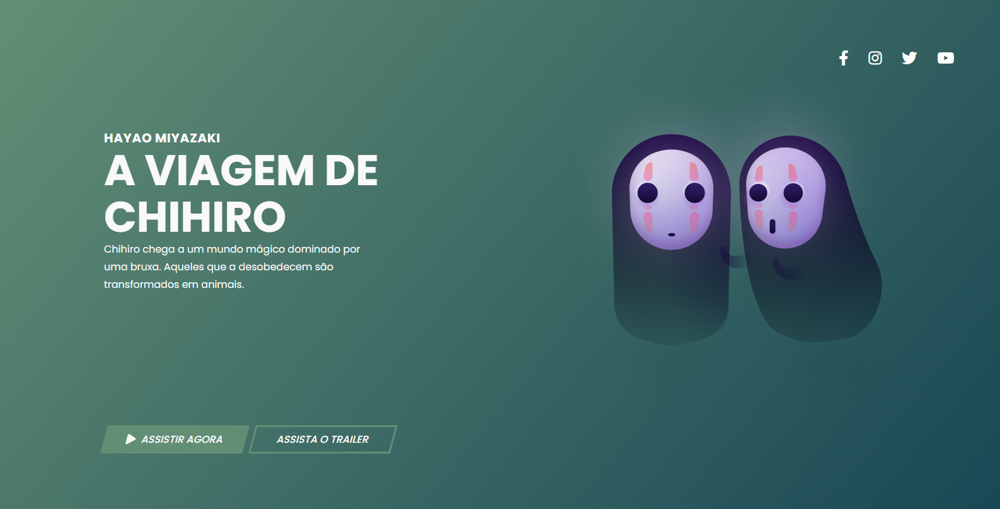

<div align="center" id="top"> 
  
&#xa0;
</div>

<h1 align="center">A VIAGEM DE CHIHIRO</h1>

<br>

## :dart: About ##

Project focused on practice my abilities of HTML and CSS 

## :rocket: Technologies ##

The tools bellow were used on this project

- [HTML]
- [CSS]

## :white_check_mark: Requirements ##

Before open the website , you need install [Git](https://git-scm.com) on your computer.

## :checkered_flag: Starting ##

```bash
#Install Pip
https://pypi.org/project/pip/

#Clone this repository
$ git clone https://github.com/Thialves02/The_island

#Starting the website
Open the index.html archive with your browser
